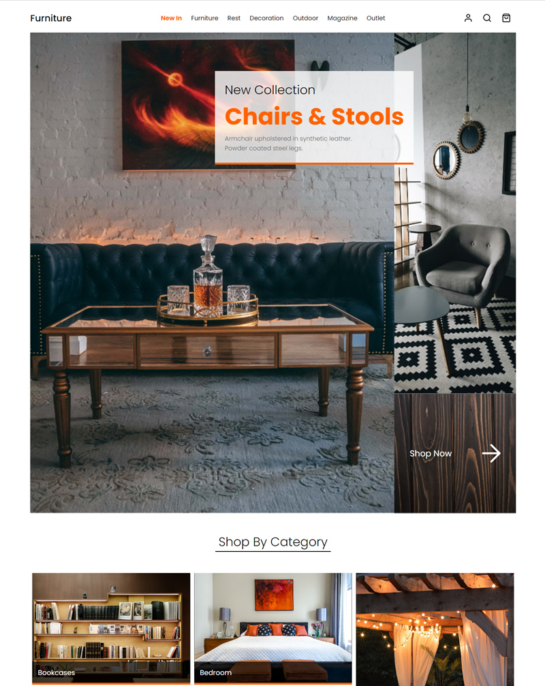

# Grid-Media-Queries-CSS-Grid-Part-3

## Description

For this task we used CSS Grid to re-create the design of an online furninute store

### User Story

To make a responsive breakpoint using `media-query`, targeting a screen size with a maximum width of 1000px.

### Acceptance Criteria

* Write CSS selectors within the media query.
* Add a CSS selector targetting the `id` of `navigation`.
* Give the CSS selector the property `margin-left` with a value of `auto`.
* Add a `media query` that targets a screen size with the `max-width of 600px`.
* Add a CSS selector that targets the `id` of `heroGrid`.
* Use `grid-template-areas`.
* Use `grid-template-columns` and `grid-template-rows`.

### Deployed Website

View the deployed application for week-2: Grid-Media-Queries-CSS-Grid-Part-3 at [makemassair.github.io](https://makemassair.github.io/Grid-Media-Queries-CSS-Grid-Part-3/).

### Screenshot

